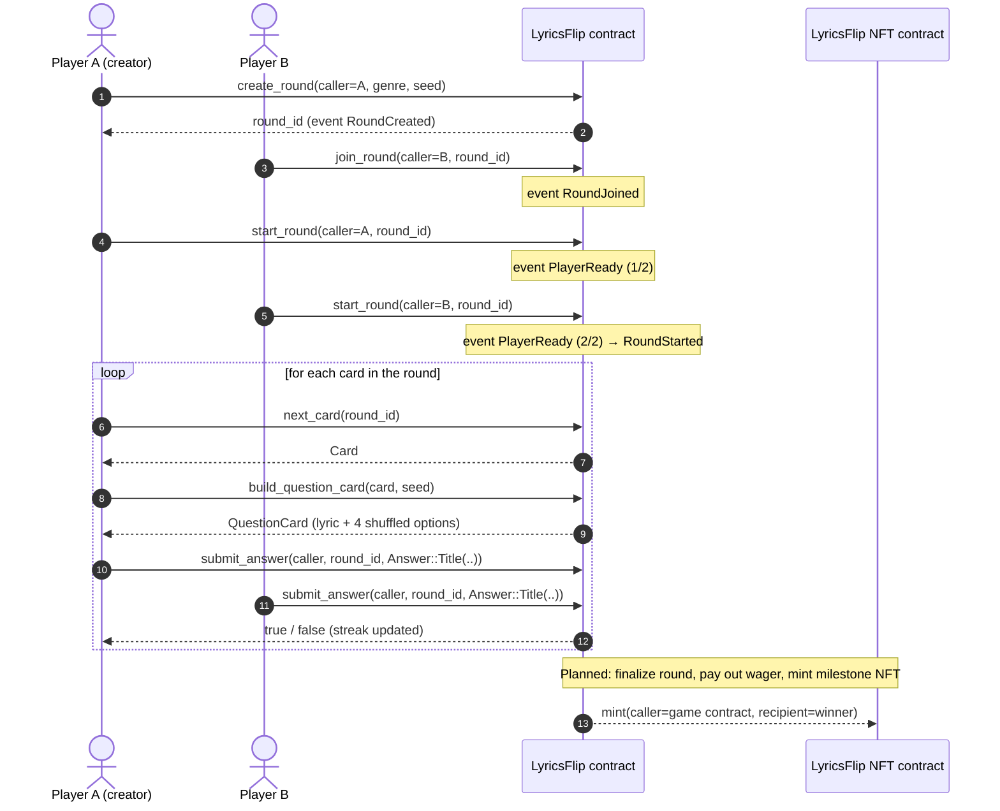
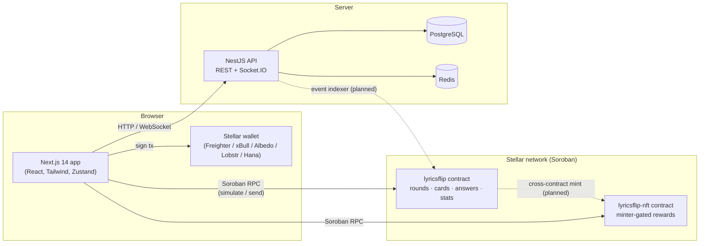

# LyricsFlip 🎶

**LyricsFlip is an on-chain, card-based music guessing game built on Stellar (Soroban).** A card shows a snippet of song lyrics, and players race to guess the song, artist, or year before the card flips. Rounds can be played solo or against friends, and players can wager tokens and earn NFT badges. Every round, answer, and stat is recorded on the Stellar blockchain.

[](https://github.com/Stellar-songifi/lyricsflip/actions/workflows/onchain.yml)

- 🎨 **Figma design:** https://www.figma.com/design/6phOWkHKQgLRhRwmBBQDXB/LyricsFlip?node-id=0-1&t=0U8SlbaJijr7XNeG-1
- 🗂️ **Issue backlog:** [`ISSUES.md`](ISSUES.md) (125 scoped issues with tasks and acceptance criteria)
- 🤝 **Contributing:** [`ContributionGuidelines.md`](ContributionGuidelines.md)

---

## Table of Contents

1. [What is LyricsFlip?](#what-is-lyricsflip)
2. [How the game works](#how-the-game-works)
3. [Architecture](#architecture)
4. [Smart contracts (Soroban)](#smart-contracts-soroban)
5. [Frontend (Next.js)](#frontend-nextjs)
6. [Backend (NestJS)](#backend-nestjs)
7. [Repository structure](#repository-structure)
8. [Getting started](#getting-started)
9. [Environment variables](#environment-variables)
10. [Testing & CI](#testing--ci)
11. [Project status & known limitations](#project-status--known-limitations)
12. [Roadmap](#roadmap)
13. [Contributing](#contributing)
14. [Related repositories](#related-repositories)

---

## What is LyricsFlip?

LyricsFlip turns "name that tune" into a Web3 game:

| Feature | Description |
|---|---|
| **Lyric cards** | Each card holds a lyric snippet plus its genre, artist, title, and release year. |
| **Timed guessing** | A card flips after **15 seconds** unless the player guesses correctly first. Correct guesses get instant feedback, such as confetti. |
| **Multiple-choice questions** | The contract builds a question with the right answer and three distractors, then shuffles them. |
| **Genres & decades** | 13 on-chain genres (Hip Hop, Pop, Rock, R&B, Electronic, Classical, Jazz, Country, Blues, Reggae, Afrobeat, Gospel, Folk). Cards are also indexed by artist and year, so categories like "90s R&B" are possible. |
| **Solo & multiplayer rounds** | Create a round, invite friends by round ID or link, get everyone "ready", and play the same cards. |
| **Token wagering** | Players stake tokens on a round and the winner takes the pot. The contract fields exist; escrow is on the roadmap. |
| **NFT rewards** | A companion NFT contract mints reward badges for milestones. |
| **Stats & streaks** | On-chain per-player stats: total rounds, rounds won, current streak, and best streak. |
| **Leaderboards & social** | A backend adds profiles, leaderboards, notifications, chat, and more on top of on-chain data. |

---

## How the game works

### From the player's side

1. **Connect a wallet.** LyricsFlip uses [Stellar Wallets Kit](https://github.com/Creit-Tech/Stellar-Wallets-Kit), so Freighter, xBull, Albedo, Lobstr, and Hana all work. Reads work without a wallet; any action that changes state needs one.
2. **Pick a mode** on the home page:
   - **Quick Game**: casual play.
   - **Wager (Single Player)**: choose genre, difficulty, duration, odds, and stake, then play against the clock.
   - **Wager (Multi Player)**: create or join a round and play against other wallets.
3. **Create or join a round.** Creating a round picks a random set of cards (`cards_per_round`, set by an admin) and makes you the round admin. Friends join with the round ID.
4. **Get ready.** Each player signs a "ready" transaction. When **every** player is ready, the round starts on-chain.
5. **Play cards.** For each card:
   - a card is drawn (`next_card`)
   - the lyric is shown with four options (`build_question_card`)
   - the player submits an answer (`submit_answer`), and the contract says whether it was correct and updates their streak
   - the card flips to reveal the answer.
6. **Finish.** After the last card, a result modal shows the score. With wagering and rewards enabled, winners claim the pot and milestone NFTs are minted.

### Round lifecycle on-chain



---

## Architecture

LyricsFlip is a monorepo with three main pieces:



| Layer | Responsibility | Source of truth for |
|---|---|---|
| **Soroban contracts** (`onchain/`) | Game rules, round state, card catalogue, answer checking, player stats, NFT ownership | Everything that involves value or fairness |
| **Frontend** (`frontend/`) | UI, wallet connection, building and signing contract calls, animations and timers | Nothing persistent. It reads from the chain and the API |
| **Backend** (`backend/`) | Profiles, leaderboards, notifications, chat, real-time multiplayer relay, song curation, and (planned) indexing of contract events | Off-chain social and metadata |

---

## Smart contracts (Soroban)

The contracts live in a Cargo workspace under [`onchain/`](onchain/) and use **soroban-sdk 27**. They were ported from the project's earlier Cairo/Starknet contracts. See [`onchain/README.md`](onchain/README.md) for build and deployment commands.

### `lyricsflip` — game contract

#### Data model (`src/types.rs`)

| Type | Fields | Notes |
|---|---|---|
| `Card` | `card_id: u64`, `genre: Genre`, `artist: String`, `title: String`, `year: u64`, `lyrics: String` | One lyric card. The id is assigned by `add_card` |
| `Genre` | `HipHop=0, Pop=1, Rock=2, RnB=3, Electronic=4, Classical=5, Jazz=6, Country=7, Blues=8, Reggae=9, Afrobeat=10, Gospel=11, Folk=12` | Encoded as a plain `u32`. Keep in sync with `frontend/src/lib/stellar/types.ts` → `GENRE_VALUES` |
| `Round` | `round_id`, `admin`, `genre`, `wager_amount: i128`, `start_time`, `is_started`, `is_completed`, `end_time`, `next_card_index: u32` | One game round |
| `QuestionCard` | `lyric`, `timestamp`, `option_one` … `option_four` | What the player sees: the lyric plus 4 shuffled title options |
| `Answer` | `Artist(String)` · `Year(u64)` · `Title(String)` | A player's guess |
| `PlayerStats` | `total_rounds`, `rounds_won`, `current_streak`, `max_streak` | Per-address stats |
| `Role` | `Admin=0` | The single admin role |

#### Storage layout (`DataKey`)

| Key | Storage | Value |
|---|---|---|
| `Owner` | instance | Contract owner address |
| `Admin(Address)` | instance | `bool`, whether the address is an admin |
| `RoundCount`, `CardsCount`, `CardsPerRound` | instance | Counters and configuration |
| `Card(u64)` | persistent | `Card` |
| `GenreCards(Genre)` / `ArtistCards(String)` / `YearCards(u64)` | persistent | `Vec<u64>` card-id indexes |
| `Round(u64)` | persistent | `Round` |
| `RoundPlayers(u64)` / `RoundCards(u64)` | persistent | Players and the drawn card ids for a round |
| `RoundReady((u64, Address))` / `RoundReadyCount(u64)` | persistent | Readiness tracking |
| `PlayerStats(Address)` | persistent | `PlayerStats` |

#### Public functions

| Function | Auth | What it does |
|---|---|---|
| `__constructor(owner)` | — | Runs at deploy time. Sets the owner and makes them an admin |
| **Admin** | | |
| `set_cards_per_round(caller, value)` | admin | Sets how many cards each round uses (> 0) |
| `add_card(caller, card)` | admin | Stores a card and indexes it by genre, artist, and year |
| `set_role(caller, recipient, role, is_enable)` | owner | Grants or revokes admin |
| **Gameplay** | | |
| `create_round(caller, genre, seed) → u64` | caller | Creates a round, draws `cards_per_round` random card ids, and adds the caller as the first player. Emits `RoundCreated` |
| `join_round(caller, round_id)` | caller | Joins a round that hasn't started (no duplicate joins). Emits `RoundJoined` |
| `start_round(caller, round_id)` | participant | Marks the caller ready (emits `PlayerReady`). When all players are ready, the round starts (emits `RoundStarted`) |
| `next_card(round_id) → Card` | — | Draws the next card of a started round. Marks the round completed after the last draw |
| `submit_answer(caller, round_id, answer) → bool` | participant | Checks the answer against the current card, records the answer time, and updates the caller's streaks and score |
| `finalize_round(caller, round_id)` | participant | Finalizes the round once it is complete or past its deadline, updates winner stats, and emits `RoundCompleted` |
| `build_question_card(card, seed) → QuestionCard` | — | Picks 3 distinct wrong titles and shuffles them with the right one |
| **Views** | | |
| `get_round`, `get_round_cards`, `get_round_players`, `get_players_round_count` | — | Round info |
| `get_round_scores(round_id)` | — | Final per-player correct-answer counts for the round |
| `get_card`, `get_cards_per_round` | — | Card info and configuration |
| `get_cards_of_genre / _of_artist / _of_a_year(…, seed)` | — | `cards_per_round` random cards from an index |
| `get_player_stat(player)` | — | `PlayerStats` (zeros if the player is unknown) |
| `is_admin(role, address)` | — | Role check |

#### Randomness

`get_random_numbers` builds a SHA-256 hash of `(seed, ledger sequence, ledger timestamp, i)` for each draw, reduces it modulo the pool size, and skips duplicates until it has enough unique values. `build_question_card` shuffles options with a linear-congruential Fisher–Yates shuffle. This is a straight port of the Cairo logic. It is **not** manipulation-resistant, because the caller supplies `seed` (see [LF-009](ISSUES.md#lf-009--card-selection-randomness-is-predictable-and-caller-controlled)).

#### Errors (`src/errors.rs`)

| Code | Name | Code | Name |
|---|---|---|---|
| 1 | `AlreadyInitialized` | 10 | `RoundNotStarted` |
| 2 | `NonExistingRound` | 11 | `RoundCompleted` |
| 3 | `RoundAlreadyStarted` | 12 | `NotAParticipant` |
| 4 | `NonExistingGenre` | 13 | `AlreadyReady` |
| 5 | `RoundAlreadyJoined` | 14 | `NotAuthorized` |
| 6 | `InvalidCardsPerRound` | 15 | `AmountExceedsLimit` |
| 7 | `ArtistCardsIsZero` | 16 | `LimitMustBeGreaterThanZero` |
| 8 | `EmptyYearCards` | 17 | `NonExistingCard` |
| 9 | `EmptyGenreCards` | | |

The SDK surfaces these as `Error(Contract, #<code>)`.

#### Events (`src/events.rs`)

| Event | Topics | Data |
|---|---|---|
| `RoundCreated` | `round_id`, `admin` | `created_time` |
| `RoundJoined` | `round_id`, `player` | `joined_time` |
| `PlayerReady` | `round_id`, `player` | `ready_time` |
| `RoundStarted` | `round_id`, `admin` | `start_time` |
| `RoundCompleted` | `round_id` | `winners`, `scores` |

### `lyricsflip-nft` — reward NFT contract

A small, minter-gated NFT:

| Function | Auth | Description |
|---|---|---|
| `__constructor(owner, minter, token_name, token_symbol, base_uri)` | — | One-time setup |
| `mint(caller, recipient) → u128` | `caller == minter` | Mints the next token id to `recipient`. Emits `NftMinted { token_id, recipient }` |
| `owner_of(token_id)` | — | Owner, or error `TokenDoesNotExist (4)` |
| `token_name`, `token_symbol`, `base_uri`, `token_count` | — | Metadata |

The intended minter is the game contract's address, so rewards can only come from gameplay. Errors: `AlreadyInitialized=1`, `NotMinter=2`, `TokenAlreadyExists=3`, `TokenDoesNotExist=4`.

---

## Frontend (Next.js)

Located in [`frontend/`](frontend/).

| Concern | Technology |
|---|---|
| Framework | Next.js 14 (App Router), React 18, TypeScript |
| Styling | Tailwind CSS, Radix UI primitives, `class-variance-authority`, Framer Motion |
| State | Zustand (with immer / persist), TanStack React Query |
| Chain | `@stellar/stellar-sdk` (`contract.Client`), `@creit.tech/stellar-wallets-kit` |
| Real-time | `socket.io-client` |
| Testing | Jest + Testing Library |

### How the frontend talks to Stellar

All chain access goes through [`src/lib/stellar/`](frontend/src/lib/stellar/):

1. **`stellarConfig.ts`** reads the RPC URL, network passphrase, and the two contract IDs from `NEXT_PUBLIC_*` env vars (defaults to testnet).
2. **`StellarProvider.tsx`** (loaded client-side only from `app/layout.tsx`):
   - initialises Stellar Wallets Kit with the Freighter, xBull, Albedo, Lobstr, and Hana modules
   - restores a previously connected address
   - exposes `connect()` / `disconnect()`, the current `account`, and config `warnings`.
3. **`client.ts`** → `createSystemCalls(config, publicKey)` returns a typed `SystemCalls` object (`createRound`, `joinRound`, `startRound`, `nextCard`, `submitAnswer`, `addCard`, `getRound`, `getPlayerStat`, `mintNft`, …):
   - it uses `contract.Client.from()`, which fetches the deployed contract's spec at runtime, so no codegen step is needed
   - **read-only calls** simulate the transaction and return `assembled.result`
   - **mutating calls** use `signAndSend()`, which asks the connected wallet to sign through `StellarWalletsKit.signTransaction`.
4. **`types.ts`** mirrors the Rust types and converts between wire and UI shapes (`genreToWire` / `genreFromWire`, and the `Answer.title()/artist()/year()` helpers).
5. **`hooks/useStellar.ts`** is what components use: `const { systemCalls, account, connect } = useStellar()`.

### Routes

| Route | File | Purpose |
|---|---|---|
| `/` | `app/page.tsx` | Welcome and game-mode selection. Opens the Quick Game or Wager modals |
| `/single-player?roundId=` | `app/single-player/page.tsx` | Single-player round: lyric card, stats panel, song options |
| `/multiplayer` | `app/multiplayer/page.tsx` | Join a round by ID, ready up, play with others |
| `/admin` | `app/admin/page.tsx` | Admin configuration (`cards_per_round`) |
| `/set-username` | `app/set-username/page.tsx` | Choose a display name |
| `/sign-in-page` | `app/sign-in-page/page.tsx` | Sign-in landing page |

### Component structure (atomic design)

- `components/atoms/`: buttons, inputs, cards, dialogs, selects, badges
- `components/molecules/`: navbar, game card, song options, statistics panel, timer display, share button
- `components/organisms/`: `LyricCard` (flip card), `WagerModal`, `WagerSummaryModal`, `GameResultModal` / `GameResultPopup`, challenge create/invite, waiting-for-opponent, `AdminConfig`
- `features/game/hooks/`: `useGameTimer`, `useSinglePlayer`
- `hooks/`: `useGameService` (create round), `use-multiplayer-room`, `useLeaderboard`, `useSongs`, `useCategories`
- `store/`: Zustand stores (game state, modals, theme, user/game slices)

---

## Backend (NestJS)

Located in [`backend/`](backend/). It provides the off-chain side of the product.

| Concern | Technology |
|---|---|
| Framework | NestJS 10 (TypeScript) |
| Database | PostgreSQL via TypeORM (`autoLoadEntities`) |
| Cache | Redis (`cache-manager`, `ioredis`) |
| Real-time | Socket.IO gateways (`config/socket-io.config.ts`) |
| Auth | JWT access and refresh tokens (`@nestjs/jwt`, Passport), bcrypt, a global `AccessTokenGuard` with a `@Public()` opt-out |
| Docs | Swagger at `/api/docs` (non-production) |
| Rate limiting | `@nestjs/throttler` |

### Main modules

| Module | Folder | Purpose |
|---|---|---|
| Auth & users | `auth/`, `user/` | Sign-in, tokens, password reset, user accounts |
| Game sessions & modes | `game-session/`, `game-mode/`, `game/` | Sessions, classic / time-attack / endless / battle-royale modes, matchmaking |
| Songs & questions | `songs/`, `song/`, `song-genre/`, `questions/` | Song catalogue, genres and tags, question bank |
| Scoring & results | `scoring/`, `game-results/`, `leaderboard/` | Points, results, rankings |
| Wagers & rewards | `wager/`, `reward/`, `power-ups/` | Wager records, rewards, in-game power-ups |
| Social | `social/`, `chat-room/`, `notification/`, `referral/` | Friends, challenges, activity feed, chat, notifications, referrals |
| Progression | `achievement/`, `tournament/`, `music-education/` | Achievements, tournaments, music lessons and quizzes |
| Infrastructure | `config/`, `logger/`, `redis/`, `common/`, `interceptors/`, `state-recovery/`, `game-insights/` | Configuration, logging, pagination, guards, recovery, analytics |

Sample requests for most endpoints are in `backend/src/http-yac/*.http`, for use with the httpYac or REST Client VS Code extensions.

> ⚠️ **Backend status:** the backend currently **does not compile**. `main.ts` and `app.module.ts` have errors, about 100 imports point to files that don't exist, and several packages are used but not declared in `package.json`. The backend also contains duplicate and experimental modules. Getting it building is tracked in [LF-073 – LF-081](ISSUES.md#backend-backend).

---

## Repository structure

```
lyricsflip/
├── onchain/                         # Rust / Soroban smart contracts (Cargo workspace)
│   ├── Cargo.toml                   # workspace + release profile (opt-level z, LTO)
│   └── contracts/
│       ├── lyricsflip/src/          # game contract: lib.rs, types.rs, errors.rs, events.rs, test.rs
│       └── lyricsflip-nft/src/      # reward NFT contract: lib.rs, test.rs
├── frontend/                        # Next.js 14 web app
│   └── src/
│       ├── app/                     # routes (/, /single-player, /multiplayer, /admin, …)
│       ├── components/              # atoms / molecules / organisms
│       ├── features/game/hooks/     # game timer, single-player logic
│       ├── hooks/                   # data + service hooks
│       ├── lib/stellar/             # Stellar provider, contract client, types, config
│       ├── services/                # REST (axios) + WebSocket clients
│       ├── store/                   # Zustand stores
│       └── __tests__/               # Jest tests
├── backend/                         # NestJS API + Socket.IO gateways
│   ├── src/                         # feature modules (see table above)
│   └── test/                        # e2e tests
├── docs/                            # design hand-off, Notion link
├── .github/workflows/onchain.yml    # CI: fmt, WASM build, tests for contracts
├── .tool-versions                   # rust 1.98.1
├── ISSUES.md                        # 125-item backlog
└── ContributionGuidelines.md
```

---

## Getting started

### Prerequisites

| Tool | Version | For |
|---|---|---|
| Rust | 1.98.1 (see `.tool-versions`) + `wasm32v1-none` target | Contracts |
| [Stellar CLI](https://developers.stellar.org/docs/tools/stellar-cli) | latest | Deploying and invoking contracts |
| Node.js | 20 LTS recommended | Frontend and backend |
| PostgreSQL / Redis | 14+ / 6+ | Backend |
| A Stellar wallet | Freighter recommended, set to **Testnet** | Playing |

### 1. Clone

```bash
git clone https://github.com/Stellar-songifi/lyricsflip.git
cd lyricsflip
```

### 2. Build, test, and deploy the contracts

```bash
cd onchain
rustup target add wasm32v1-none
cargo test                                    # unit tests
cargo build --target wasm32v1-none --release  # → target/wasm32v1-none/release/*.wasm
```

Deploy to testnet (create and fund an identity first with `stellar keys generate --global me --network testnet --fund`):

```bash
# Game contract
stellar contract deploy \
  --wasm target/wasm32v1-none/release/lyricsflip.wasm \
  --source me --network testnet \
  -- --owner $(stellar keys address me)

# NFT contract (minter = game contract ID from the previous step)
stellar contract deploy \
  --wasm target/wasm32v1-none/release/lyricsflip_nft.wasm \
  --source me --network testnet \
  -- --owner $(stellar keys address me) --minter <LYRICSFLIP_CONTRACT_ID> \
     --token_name "LyricsFlip" --token_symbol "LFLIP" --base_uri "https://example.com/nft/"
```

Configure the game and add some cards:

```bash
stellar contract invoke --id <LYRICSFLIP_CONTRACT_ID> --source me --network testnet \
  -- set_cards_per_round --caller $(stellar keys address me) --value 5

stellar contract invoke --id <LYRICSFLIP_CONTRACT_ID> --source me --network testnet \
  -- add_card --caller $(stellar keys address me) \
  --card '{"card_id":0,"genre":1,"artist":"Demo Artist","title":"Demo Song","year":1999,"lyrics":"Demo lyric line"}'
```

> `build_question_card` needs **at least 4 distinct titles** (3 wrong options plus the right one); `create_round` needs at least `cards_per_round` cards.

### 3. Run the frontend

```bash
cd frontend
npm install
cat > .env.local <<'ENV'
NEXT_PUBLIC_STELLAR_RPC_URL=https://soroban-testnet.stellar.org
NEXT_PUBLIC_STELLAR_NETWORK_PASSPHRASE=Test SDF Network ; September 2015
NEXT_PUBLIC_LYRICSFLIP_CONTRACT_ID=<LYRICSFLIP_CONTRACT_ID>
NEXT_PUBLIC_LYRICSFLIP_NFT_CONTRACT_ID=<LYRICSFLIP_NFT_CONTRACT_ID>
NEXT_PUBLIC_API_URL=http://localhost:4000
ENV
npm run dev        # http://localhost:3000
```

### 4. Run the backend

```bash
cd backend
npm install
cp .env.example .env.development   # fill in the values (see variables below); use a port other than 3000 so it doesn't clash with Next.js
npm run start:dev  # Swagger at http://localhost:<PORT>/api/docs
```

> The backend doesn't build yet. See [Project status](#project-status--known-limitations).

---

## Environment variables

### Frontend (`frontend/.env.local`)

| Variable | Default | Description |
|---|---|---|
| `NEXT_PUBLIC_STELLAR_RPC_URL` | `https://soroban-testnet.stellar.org` | Soroban RPC endpoint |
| `NEXT_PUBLIC_STELLAR_NETWORK_PASSPHRASE` | `Test SDF Network ; September 2015` | Network passphrase (also picks the wallet-kit network) |
| `NEXT_PUBLIC_LYRICSFLIP_CONTRACT_ID` | — | Deployed game contract ID (`C…`) |
| `NEXT_PUBLIC_LYRICSFLIP_NFT_CONTRACT_ID` | — | Deployed NFT contract ID (`C…`) |
| `NEXT_PUBLIC_API_URL` | `http://localhost:3000/api` | Backend base URL |

### Backend (`backend/.env`, see `backend/.env.example`)

| Variable | Required | Description |
|---|---|---|
| `NODE_ENV` | no | `development` / `production` / `test` / `staging` |
| `PORT` | no | HTTP port (default 4000) |
| `DATABASE_URL` | yes | Postgres connection string |
| `JWT_SECRET` | yes | Secret used to sign access/refresh JWTs |
| `JWT_REFRESH_SECRET` | no | Secret used by the legacy `/auth/refresh` flow |
| `JWT_TOKEN_AUDIENCE`, `JWT_TOKEN_ISSUER` | no | JWT `aud`/`iss` claims |
| `JWT_ACCESS_TOKEN_TTL`, `JWT_REFRESH_TOKEN_TTL` | no | Token lifetimes, in seconds |
| `STELLAR_NETWORK` | yes | `testnet` / `futurenet` / `mainnet` |
| `SOROBAN_RPC_URL` / `STELLAR_RPC_URL` | no | Soroban RPC endpoint used by the event indexer and `/health` |
| `LYRICSFLIP_CONTRACT_ID` | no | Deployed game contract ID the indexer watches |
| `REDIS_HOST`, `REDIS_PORT` | no | Redis (defaults `localhost:6379`) |
| `REDIS_URL` | no | Redis connection URL (cache/throttler storage) |
| `RATE_LIMIT_TTL`, `RATE_LIMIT_LIMIT` | no | Global throttling window (ms) and limit |
| `CORS_ORIGINS` | no | Comma-separated allowed origins, or `*` |
| `SMTP_HOST`, `SMTP_PORT`, `SMTP_SECURE`, `SMTP_USER`, `SMTP_PASS`, `MAIL_FROM` | no | Outgoing email (password reset) |
| `APP_URL` | no | Public base URL, used to build shareable links |
| `ANALYTICS_API_KEY` | no | Shared secret for the `x-analytics-key` header |
| `DB_SYNCHRONIZE`, `DB_MIGRATIONS_RUN` | no | TypeORM schema sync / auto-run migrations on boot |
| `PASSWORD_RESET_TTL_MINUTES`, `LOG_LEVEL` | no | Password reset token lifetime, logger verbosity |

---

## Testing & CI

| Package | Command | Notes |
|---|---|---|
| Contracts | `cd onchain && cargo test` | 11 game-contract tests and 4 NFT tests using `soroban-sdk` testutils |
| Frontend | `cd frontend && npm test` | Jest + jsdom (`src/__tests__/`) |
| Backend | `cd backend && npm test` / `npm run test:e2e` | Jest (`*.spec.ts`) |

GitHub Actions (`.github/workflows/onchain.yml`) runs `cargo fmt --check`, a release WASM build, and `cargo test` on every push to `main` and on every PR. Frontend and backend CI are planned ([LF-106](ISSUES.md#lf-106--ci-workflow-for-the-frontend), [LF-107](ISSUES.md#lf-107--ci-workflow-for-the-backend)).

---

## Project status & known limitations

LyricsFlip is under active development, following its migration from Starknet to Stellar. What works today, and what doesn't yet:

**✅ Working**
- Both Soroban contracts build to WASM and pass their unit tests in CI.
- Rounds can be created, joined, readied, and started. Cards can be added, drawn, and answered. Streaks are tracked on-chain.
- The frontend connects Stellar wallets and can call every contract function through `SystemCalls`.

**🚧 Known gaps** (each is tracked in [`ISSUES.md`](ISSUES.md))
- **Contract logic:**
  - `create_round` doesn't restrict cards to the chosen genre (LF-001).
  - The last card of a round can't be answered (LF-003).
  - Players can answer the same card more than once (LF-004).
  - `rounds_won` is never updated (LF-005).
  - `next_card` is unauthenticated (LF-007).
  - Answers are readable on-chain (LF-008).
  - Storage TTLs aren't extended (LF-012).
- **Wagering and payouts** are not implemented yet. `wager_amount` is always 0 (LF-013, LF-014).
- **NFT rewards** aren't connected to gameplay yet (LF-017).
- **Frontend:**
  - The single-player and multiplayer screens still use mock lyric and room data (LF-042, LF-043).
  - A few imports point at a missing `src/mock` module (LF-035).
  - Some Starknet-era labels remain, such as "STRK" and "Argent" (LF-039, LF-040).
- **Backend** doesn't compile yet and has duplicate modules (LF-073 – LF-080).

---

## Roadmap

[`ISSUES.md`](ISSUES.md) holds 125 issues grouped by area, each with a description, a task list, and acceptance criteria:

| Range | Area |
|---|---|
| LF-001 – LF-034 | Smart contracts: correctness, security, wagering, NFTs, upgradeability, tests |
| LF-035 – LF-072 | Frontend: wiring real gameplay, wallet UX, multiplayer, admin, accessibility, tests |
| LF-073 – LF-105 | Backend: getting it to build, wallet auth, event indexer, leaderboards, real-time protocol |
| LF-106 – LF-115 | DevOps: CI for every package, deployments, tooling |
| LF-116 – LF-125 | Docs & community: contributing guide, architecture, game rules, licensing |

Suggested order: **P0 contract fixes → frontend build fixes + wallet UX → real on-chain gameplay → backend build + indexer → wagering → NFTs**.

---

## Contributing

Contributions are welcome! Please read [`ContributionGuidelines.md`](ContributionGuidelines.md) first. In short:

1. Pick an issue from [`ISSUES.md`](ISSUES.md) (or GitHub Issues) and comment to claim it. **Issues tagged for an event must not be applied for before the event starts.**
2. Create a branch (never push to `main`).
3. Keep PRs focused. Include a clear description, link the issue, and show test evidence or screenshots.
4. Make sure `cargo fmt --check && cargo test` (contracts) and `npm run lint && npm test` (frontend/backend) pass.

Design references: [Figma](https://www.figma.com/design/6phOWkHKQgLRhRwmBBQDXB/LyricsFlip?node-id=0-1&t=0U8SlbaJijr7XNeG-1), [`docs/design/`](docs/README.md).

---

## Related repositories

📱 **Mobile app:** as part of the move to a multi-repo architecture, the LyricsFlip mobile app is being migrated to its own repository: [LyricsFlip Mobile](https://github.com/songifi/lyricsflip_mobile). This keeps mobile-specific code isolated and easier to maintain.

## Handsoff notes

<!-- handsoff-issue-487 -->
- #487: LF-070 · Fix misspelled file and component names
<!-- handsoff-issue-485 -->
- #485: LF-068 · Add `frontend/.env.example`
