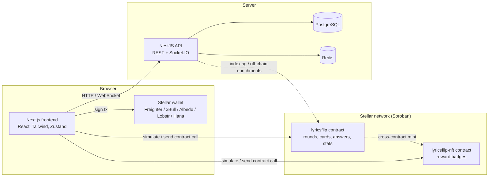
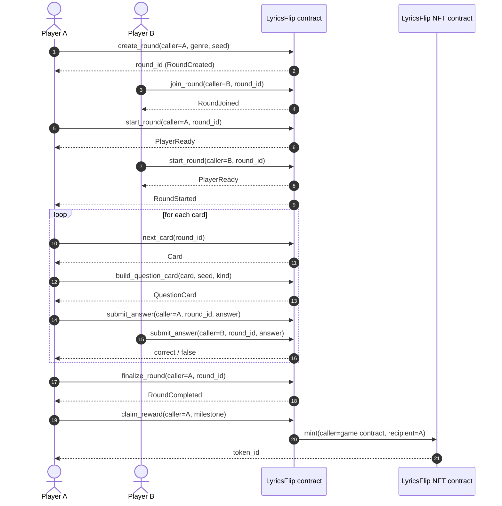

# Architecture

This document stays aligned with the project README, especially the "How the game works" flow and the architecture summary.

## Component overview

## Round lifecycle

## Lifecycle and ownership summary

The game flow matches the README's player-facing flow:

1. Create a round.
2. Invite players and let them join.
3. Everyone marks ready.
4. The round starts on-chain.
5. Each card is drawn and answered.
6. The round is finalized.
7. Milestone claims mint reward NFTs.

## Data ownership: chain vs. database

| Concern | Source of truth | Notes |
|---|---|---|
| Game state and fairness | Stellar chain / Soroban contracts | Round state, card catalogue, answer checks, winner selection, per-player stats, minting flows |
| NFT ownership and rewards | Stellar chain / NFT contract | Token ownership and transfer history are on-chain |
| Wallet signers and session UX | Frontend only | The browser keeps the wallet connection and local UI state; it does not own persisted game truth |
| Profiles, leaderboards, chat, notifications, realtime relay | Backend database | PostgreSQL/Redis store off-chain social data, metadata, and real-time sessions |
| Song metadata and curation | Backend database and API | The chain stores gameplay facts; the backend stores non-critical social or editorial data |
| Contract event indexing | Backend indexer / API | Useful for analytics, feeds, and UI queries beyond raw on-chain reads |

## Ownership model

- The Soroban contracts are the source of truth for all value-bearing and fairness-critical state.
- The frontend is a client that reads chain data and submits signed transactions.
- The backend is an off-chain extension that enriches the game with profiles, social features, and indexable events.
- The contract is not replaced by the database; the database is for user experience and operational data, not game authority.

## Implementation notes

- The frontend reads from the chain and the API; it never becomes the authoritative store for game state.
- The `lyricsflip` contract owns the round logic and answer validation.
- The `lyricsflip-nft` contract owns the reward token lifecycle and ownership semantics.
- The backend can index contract events, but the chain remains the root of trust.
